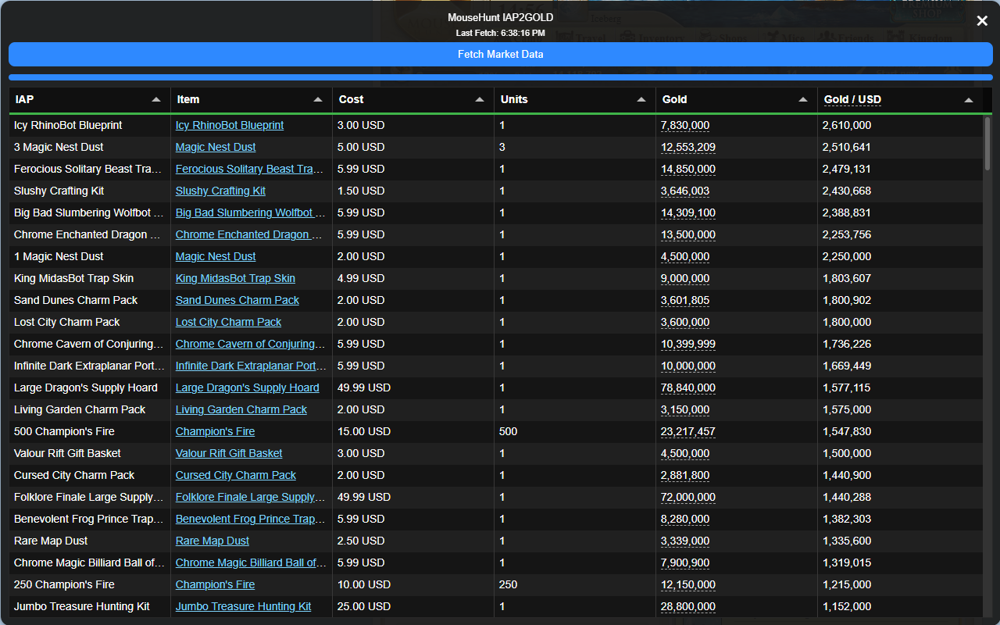
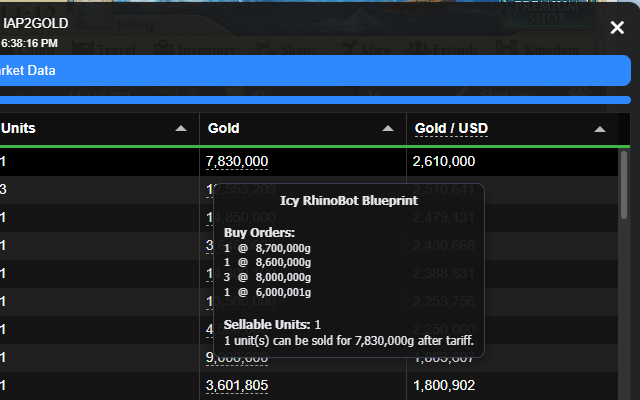

# 🧀 MouseHunt IAP2Gold 🧀

  

**MouseHunt IAP2Gold** is a browser extension for MouseHunt that calculates the gold value of premium shop rewards (IAPs) using live marketplace buy orders.

It helps players identify which IAP give the most gold for their money, making in-game purchases more cost-effective.  

## 📥 Installation

- **Chrome:** [Install on Chrome Web Store](https://chromewebstore.google.com/detail/mousehunt-iap2gold)  

## ✨ Features

- Calculates current market value for all MouseHunt IAP rewards  
- Uses live marketplace buy orders for accurate, up-to-date estimates  
- Helps identify the most cost-effective purchases  
- Set preferred store and local currencies for accurate value calculations  
- Floating widget with sortable table and detailed buy order tooltips  

## 📸 Screenshots

   
  Shows IAP details and their gold value using live market data.

   
  Tooltip to show detailed breakdown of buy orders and sellable units.

## 📖 License

This project is licensed under the **MIT License**. See the [LICENSE](./LICENSE) file for full details.  
